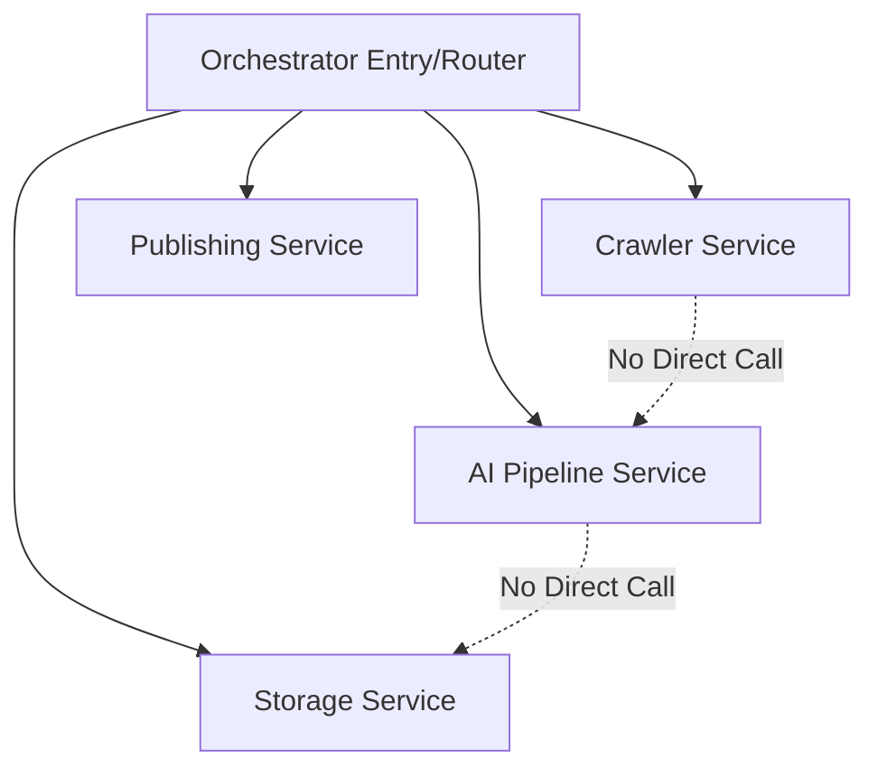

# Gemini — Project Standards & Best Practices (v1.1)

> **Principles**: High Cohesion, Low Coupling, Extreme Simplicity.
> **Goal**: Ensure consistency and maintainability for the AI Journal project under large-scale AI collaboration.

---

## 1. The 200-Line Rule (Critical Redline)

This is the **primary constraint** of the project. Any single source file (`.ts`, `.tsx`) **must not exceed 200 lines of code**.

### Why 200 Lines?
- **Readability**: Any file can be understood within 5 minutes.
- **Low Coupling**: Forces feature growth through composition rather than bloat.
- **AI-Friendly**: Minimal file structure allows AI to process context more accurately with fewer hallucinations.

### What to do if it exceeds 200 lines?
1. **Extract Utils**: Move helper functions to `utils/`.
2. **Split Components**: Break React components into the `components/` directory.
3. **Decompose Services**: Split large services into focused micro-services (e.g., `CrawlerService` split into `FeedCollector` and `DedupEngine`).
4. **Abstract Hooks**: Separate business logic from UI.

---

## 2. Architectural Standards: Cohesion & Coupling

### 2.1 Service Isolation
- **No Cross-Service Imports**: Sub-modules under `services/` (e.g., `crawler` and `ai`) are forbidden from calling each other directly.
- **Orchestration Layer**: All data flow between modules must be managed via the `orchestrator` or `index.ts` (entry point).



### 2.2 Dependency Injection (DI)
- Avoid hardcoding environment variables or global singletons inside modules.
- Use constructor injection to facilitate testing and modularity.

```typescript
// ✅ Recommended
class Gatekeeper {
  constructor(private config: Config, private api: ApiClient) {}
}

// ❌ Avoid
import { CONFIG } from '../config'; // No external global dependency
```

---

## 3. Verification & Technical Debt Prevention

To minimize technical debt and ensure stability, the following verification mechanism is mandatory:

### 3.1 Feature-Driven Testing
- **Mandatory Test Scripts**: For every small feature or bug fix, a corresponding verification script must be created in the `tests/` directory.
- **Verification First**: Code is not considered "done" until it passes its localized test script.
- **Regression Prevention**: These scripts serve as documentation and guards against future breaking changes.

### 3.2 Test Structure
- `tests/unit/`: Logic-specific tests for utils and small services.
- `tests/integration/`: Verification of the data flow between services (via the orchestrator).
- `tests/manual/`: Temporary scripts for verifying AI prompts or external API responses.

---

## 4. Best Development Practices

### 4.1 Zero Any Policy
- The use of `any` is strictly forbidden. Define `interface` or `type` for all data, especially when interfacing with 3rd-party APIs.
- Use standardized data models (e.g., `SourceItem`, `Article`) for core business flows.

### 4.2 Defensive Coding
- **External API Calls**: Must be wrapped in `try-catch` blocks with clear error logging.
- **Boundary Checks**: Always assume AI output might be malformed JSON or contains unexpected fields.

### 4.3 Async Orchestration
- Favor parallel processing for independent async tasks (e.g., fetching multiple RSS feeds).
- Use `Promise.allSettled` to ensure partial failures do not crash the entire pipeline.

---

## 5. Naming & Directory Conventions

| Category | Convention | Example |
|------|------|------|
| **Filenames** | kebab-case | `gatekeeper-service.ts` |
| **Components** | PascalCase | `ArticleCard.tsx` |
| **Variables/Functions** | camelCase | `fetchSources()` |
| **Constants** | SNAKE_CASE | `MAX_TOKEN_LIMIT` |

### Focused Directory Responsibilities
- `types/`: Interface definitions only, no logic.
- `constants/`: Configuration data only, no logic.
- `services/`: Core business logic, kept pure and isolated.
- `utils/`: Stateless helper functions.
- `tests/`: Feature verification scripts.

---

## 6. Definition of Done (DoD)

Before submitting any code, verify against this checklist:

- [ ] **Line Count**: Is the file under 200 lines?
- [ ] **Single Responsibility**: Can the module's function be described in one sentence?
- [ ] **Coupling Check**: Are there zero direct imports from other `services` sub-modules?
- [ ] **Hardcoding Check**: Are all magic values moved to `constants.ts`?
- [ ] **Type Safety**: Are there zero `any` types?
- [ ] **Verification**: Is there a verification script in `tests/` for this feature?
- [ ] **Error Resilience**: Does the code handle external failures gracefully?

---

> [!IMPORTANT]
> **Code is Documentation**. If logic requires extensive comments to explain, it usually means the module should be refactored.
